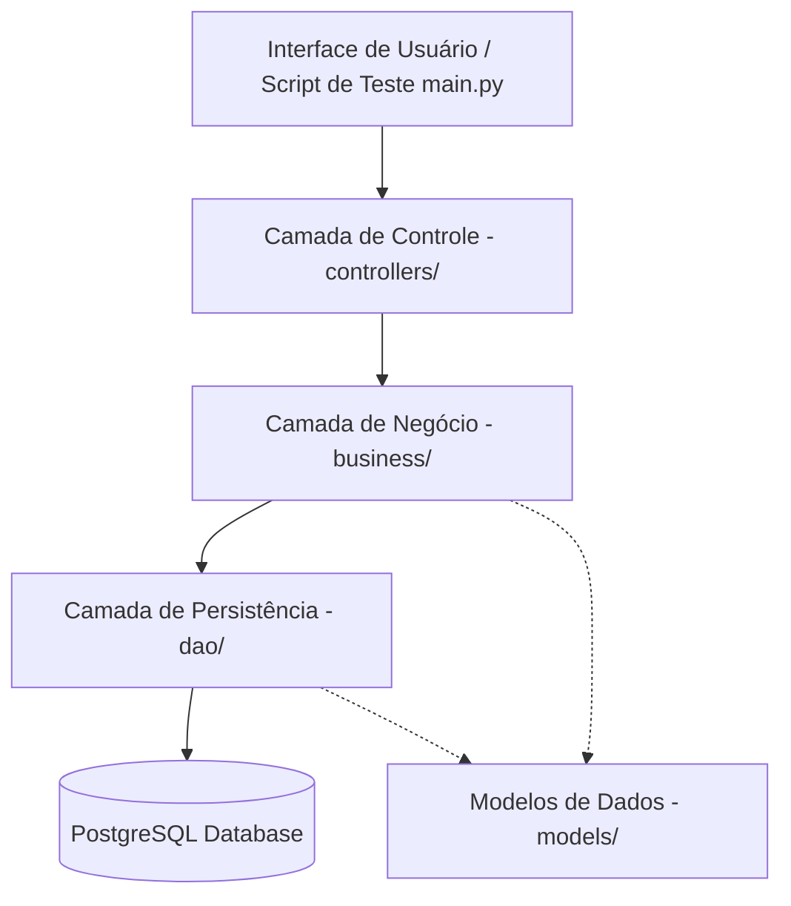
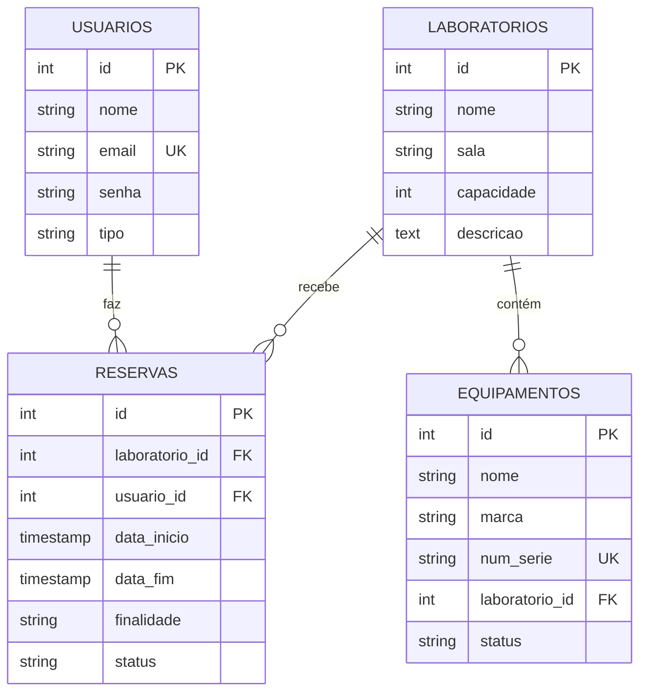

# Documento de Arquitetura e Especificação do Projeto Integrador
**Sistema de Gestão de Laboratórios**

Este documento detalha o protótipo de software desenvolvido para a segunda parte do projeto integrador, focado na aplicação de boas práticas de Engenharia de Software, arquitetura em camadas, banco de dados relacional e padrões de projeto (GoF).

---

## 1. Descrição do Software Escolhido
Foi escolhido o **Sistema de Gestão de Laboratórios**, um sistema voltado para instituições de ensino ou pesquisa para gerenciar a ocupação de espaços (laboratórios), o inventário de equipamentos alocados a esses espaços, as contas de usuários (alunos, professores, administradores) e o controle de reservas com validação de regras de negócio complexas.

### Escopo do Protótipo
O backend do protótipo foi implementado em **Python 3** utilizando o driver de banco de dados nativo **PostgreSQL** (`psycopg2`), sem o uso de qualquer framework de persistência (como ORMs/SQLAlchemy/Django ORM) ou de injeção de dependência. Toda a lógica segue estritamente a orientação a objetos sem o uso de métodos estáticos.

---

## 2. Desenho da Arquitetura de Software e Explicação

A arquitetura do sistema é estruturada em **5 camadas**, garantindo acoplamento fraco e alta coesão entre os componentes:



### Explicação das Camadas:
1. **Interface de Usuário / Test Runner (`main.py`)**: Ponto de entrada do sistema. No protótipo do backend, simula os eventos que ocorreriam na interface gráfica (GUI), acionando os controladores.
2. **Camada de Controle (`controllers/`)**: Trata as requisições e eventos da interface. Ela captura os dados brutos, instancia e preenche os objetos do modelo, chama os serviços apropriados e retorna as respostas estruturadas (sucesso, dados formatados ou mensagens de erro).
3. **Camada de Negócio (`business/`)**: Onde residem as regras de negócio do sistema. Esta camada valida se os dados são consistentes, aplica permissões de usuários e invoca as estratégias de validação de conflitos de reserva.
4. **Modelos de Dados (`models/`)**: Contém as entidades de domínio do sistema (`Usuario`, `Laboratorio`, `Equipamento`, `Reserva`) representadas por classes orientadas a objetos simples (POPOs - Plain Old Python Objects).
5. **Camada de Persistência (DAO) (`dao/`)**: Responsável pelo acesso ao SGBDR (PostgreSQL). Utiliza consultas SQL cruas (`psycopg2`) para realizar operações de INSERT, SELECT, UPDATE e DELETE, mapeando as tuplas do banco de dados para os objetos da camada de modelo.

### Padrões de Projeto (GoF) Utilizados:

#### 1. DAO Factory (Factory Method)
Para obter instâncias de classes DAO sem acoplamento forte com o banco de dados direto, foi utilizado o padrão **Factory Method**.
- Uma classe `DAOFactory` é instanciada e expõe métodos (como `get_usuario_dao(connection)`) que recebem a conexão ativa e retornam a instância correspondente do DAO.
- Isso evita a instanciação manual repetitiva e permite trocar a implementação dos DAOs se necessário, sem impactar as classes de negócio.

#### 2. Strategy Pattern (Validação de Reservas)
A validação de regras de reserva utiliza o padrão **Strategy**.
- Uma interface abstrata `ValidationStrategy` é herdada por estratégias concretas:
  - `EntityExistenceStrategy`: Valida se o usuário e o laboratório referenciados existem no banco.
  - `UserPermissionStrategy`: Valida se um `ALUNO` está tentando reservar por mais de 4 horas (limitação de tempo para alunos).
  - `TimeConflictStrategy`: Valida se há choque de horários com outras reservas aprovadas no mesmo laboratório.
- A classe de contexto `ReservationValidator` recebe e executa dinamicamente a lista de estratégias. Adicionar novas regras de validação exige apenas a criação de uma nova classe de estratégia, sem alterar o código do serviço de reservas (princípio Aberto/Fechado).

---

## 3. Diagrama Entidade-Relacionamento (DER)

O modelo de dados relacional foi estruturado para refletir com fidelidade as dependências lógicas do sistema.



### Explicação do DER:
- **Usuários e Reservas (1:N)**: Um usuário pode realizar múltiplas reservas ao longo do tempo. Cada reserva está estritamente vinculada a um único usuário.
- **Laboratórios e Reservas (1:N)**: Um laboratório pode ter várias reservas agendadas. Cada registro de reserva aponta para um único laboratório.
- **Laboratórios e Equipamentos (1:N)**: Um laboratório físico abriga zero ou vários equipamentos cadastrados no inventário. Se um laboratório for excluído, os equipamentos podem ter sua referência atualizada para `NULL` (sem laboratório) para fins de manutenção.

---

## 4. Passagem do DER para Tabelas

Abaixo estão as definições de mapeamento lógico para as tabelas físicas implementadas no PostgreSQL:

### Tabela: `usuarios`
- `id`: `SERIAL` (Auto-incremento), Chave Primária.
- `nome`: `VARCHAR(100)`, Não Nulo.
- `email`: `VARCHAR(100)`, Não Nulo, Restrição Única (`UNIQUE`).
- `senha`: `VARCHAR(100)`, Não Nulo.
- `tipo`: `VARCHAR(20)`, Restrição de domínio (`CHECK (tipo IN ('ALUNO', 'PROFESSOR', 'ADMINISTRADOR'))`).

### Tabela: `laboratorios`
- `id`: `SERIAL`, Chave Primária.
- `nome`: `VARCHAR(100)`, Não Nulo.
- `sala`: `VARCHAR(50)`, Não Nulo.
- `capacidade`: `INT`, Não Nulo, Restrição (`CHECK (capacidade > 0)`).
- `descricao`: `TEXT`, Opcional.

### Tabela: `equipamentos`
- `id`: `SERIAL`, Chave Primária.
- `nome`: `VARCHAR(100)`, Não Nulo.
- `marca`: `VARCHAR(100)`, Não Nulo.
- `num_serie`: `VARCHAR(100)`, Restrição Única (`UNIQUE`).
- `laboratorio_id`: `INT`, Chave Estrangeira referenciando `laboratorios(id)` com `ON DELETE SET NULL`.
- `status`: `VARCHAR(20)`, Restrição (`CHECK (status IN ('ATIVO', 'MANUTENCAO', 'INATIVO'))`).

### Tabela: `reservas`
- `id`: `SERIAL`, Chave Primária.
- `laboratorio_id`: `INT`, Chave Estrangeira referenciando `laboratorios(id)` com `ON DELETE CASCADE`.
- `usuario_id`: `INT`, Chave Estrangeira referenciando `usuarios(id)` com `ON DELETE CASCADE`.
- `data_inicio`: `TIMESTAMP`, Não Nulo.
- `data_fim`: `TIMESTAMP`, Não Nulo.
- `finalidade`: `VARCHAR(255)`, Não Nulo.
- `status`: `VARCHAR(20)`, Restrição (`CHECK (status IN ('PENDENTE', 'APROVADA', 'CANCELADA'))`).
- *Restrição de Tabela*: `CONSTRAINT chk_datas CHECK (data_fim > data_inicio)` para evitar inconsistência de horários.

---

## 5. Instruções de Uso e Telas do Sistema

### Uso do Backend e Consultas Relacionadas
O sistema expõe sua API de backend através das classes de controle. Para demonstrar a integração, o arquivo `main.py` serve como controlador geral de testes da aplicação:
- Ele inicializa os dados do banco.
- Lista os dados básicos semeados (comprovando a inserção mínima de 3 linhas por tabela).
- Tenta cadastrar novos usuários, laboratórios e equipamentos.
- **Consulta por Dados Relacionados**:
  - Busca e lista todos os equipamentos alocados a um laboratório específico.
  - Busca e lista o histórico de reservas de um laboratório.
  - Obtém informações do Usuário e do Laboratório de forma relacionada a partir do ID de uma reserva.
- **Validação de Regras de Negócio**:
  - Tenta cadastrar reserva para ALUNO com mais de 4 horas (gera erro de validação).
  - Tenta cadastrar reserva no mesmo laboratório e horário conflitante (gera erro de validação).
  - Cadastra reserva válida (sucesso).

### Telas do Sistema (Mock da Interface Gráfica / Frontend)
No protótipo completo, a interface gráfica (prevista para ser desenvolvida em parceria ou nas etapas subsequentes com uso de Tkinter, PyQt ou web framework) compreende as seguintes telas principais:
1. **Tela de Autenticação / Login**: Entrada para o sistema onde o usuário informa e-mail e senha. A partir disso, o sistema identifica se é aluno, professor ou administrador para limitar as opções na interface gráfica.
2. **Painel de Laboratórios (Dashboard)**: Exibe a lista de salas e laboratórios disponíveis. Ao clicar em um laboratório, o usuário pode visualizar os **equipamentos relacionados** e a agenda de ocupação (**reservas relacionadas**).
3. **Formulário de Cadastro/Reserva**: Tela onde professores e alunos selecionam o laboratório, finalidade e o período (datas e horários). A validação em tempo real avisa se houver choque de horário ou limite de tempo estourado.
4. **Gerenciamento de Equipamentos**: Tela administrativa para gerenciar o status dos equipamentos (ex: alterar de "ATIVO" para "MANUTENCAO") e alocá-los a laboratórios específicos.

---

## 6. Instruções de Instalação e Execução

Este projeto é 100% multiplataforma e funciona tanto em **Linux** quanto em **Windows** ou **macOS**.

### Pré-requisitos
- **Python 3** instalado.
- **PostgreSQL** instalado e rodando localmente na porta default (`5432`).

---

### Configuração no Linux (Ubuntu/Mint/Debian)

#### 1. Configurar Banco de Dados e Usuário
Abra o terminal e execute:
```bash
sudo -u postgres psql -c "CREATE ROLE lab_user WITH LOGIN PASSWORD 'lab_password';"
sudo -u postgres psql -c "CREATE DATABASE gestao_laboratorio OWNER lab_user;"
```

#### 2. Instalar o Driver do PostgreSQL para Python
```bash
sudo apt-get update
sudo apt-get install -y python3-psycopg2
```

#### 3. Criar as Tabelas e Dados Iniciais (Seeds)
```bash
PGPASSWORD=lab_password psql -h 127.0.0.1 -U lab_user -d gestao_laboratorio -f schema.sql
```

#### 4. Executar o Protótipo
```bash
python3 main.py
```

---

### Configuração no Windows

#### 1. Configurar Banco de Dados e Usuário
Abra o **SQL Shell (psql)** ou acesse o **pgAdmin** e execute as seguintes queries SQL:
```sql
CREATE ROLE lab_user WITH LOGIN PASSWORD 'lab_password';
CREATE DATABASE gestao_laboratorio OWNER lab_user;
```

#### 2. Instalar o Driver do PostgreSQL para Python
Abra o Command Prompt (`cmd`) ou o PowerShell e execute:
```cmd
pip install psycopg2-binary
```

#### 3. Criar as Tabelas e Dados Iniciais (Seeds)
No Command Prompt (`cmd`) ou PowerShell, navegue até a pasta do projeto e execute:
```cmd
set PGPASSWORD=lab_password
psql -h 127.0.0.1 -U lab_user -d gestao_laboratorio -f schema.sql
```
*(Nota: Se o comando `psql` não for reconhecido, certifique-se de que a pasta `bin` do PostgreSQL está adicionada ao PATH do Windows).*

#### 4. Executar o Protótipo
```cmd
python main.py
```

---

## 7. Link do Vídeo de Apresentação
Abaixo está o link para o vídeo de apresentação de até 5 minutos explicando a arquitetura utilizada, o código-fonte, a instalação e o uso do sistema:

> [!IMPORTANT]
> **Link do Vídeo**: [Insira aqui o link do YouTube/Drive do vídeo explicativo de 5 minutos]

---
**Desenvolvido pelo Grupo de Integração**
(Grupo composto de 5 a 8 alunos)
- Sandro Roni Soares
- João Pedro Castro de Brito
- Gabriel Antoniazzi
- Eduarda Pedroso Silva
- Fernando Flores da Cunha

